# Laboratorio 1 

Brayan Stiven Chaparro Cataño

### Actividad  #1

1. Entidad Paciente

>* int: id_paciente
>* string: Nombre
>* string: Apellido
>* int: dni
>* date: fecha_nacimiento

*Cada uno de los atributos que se elegio tanto como nombre, apellido, dni y fecha es como se puede identificar al paciente*

***

2. Entidad Doctor

>* int: id_doctor
>* string: Nombre
>* string: Apellido
>* string: especialidad
>* int: Licencia

*Cada uno de los atributos que se elegio tanto como nombre, apellido, especialida y numero de licencia es como se puede identificar al doctor ademas del agregado como lo es el id*

***

3. Entidad Citas

>* date: fecha_cita
>* string: sintomas
>* boolean: estado
>* int: id_doctor_encargado
>* int: id_paciente

*Cada uno de los atributos eleguidos creo que son los que identifican una cita y los id que se agregan es para dar a ver que existe una relación en cita con la entidad doctoy y paciente*

### Actividad #2

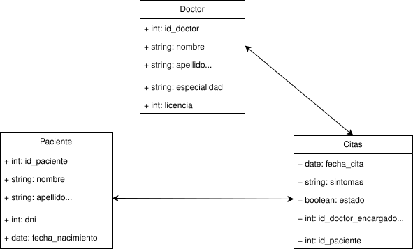

### Actividad #3

Instalación de mysql server

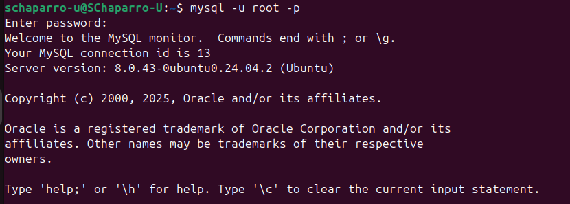

Creacion de base de datos desde el cli de mysql

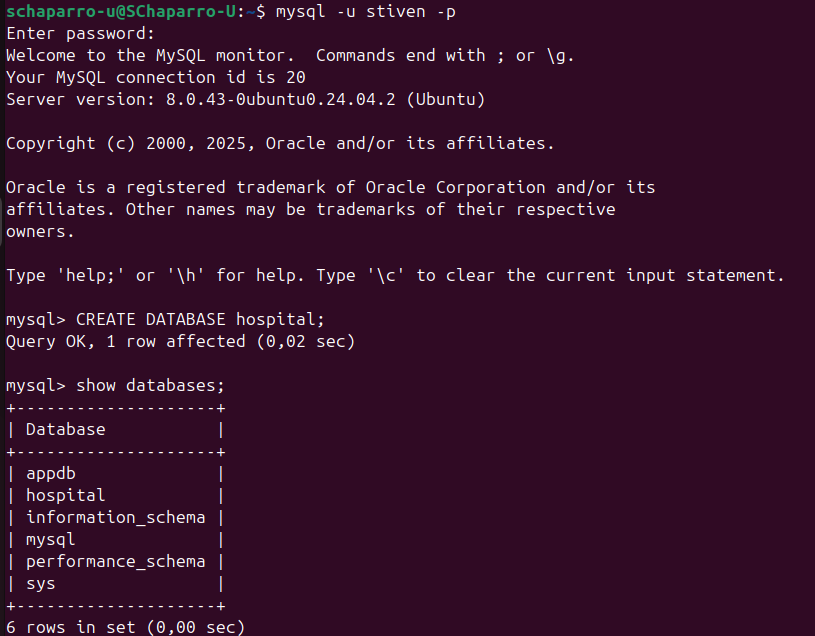

Intalación y conexion Workbench

Creación de base de datos desde interfaz grafica mysqul workbench
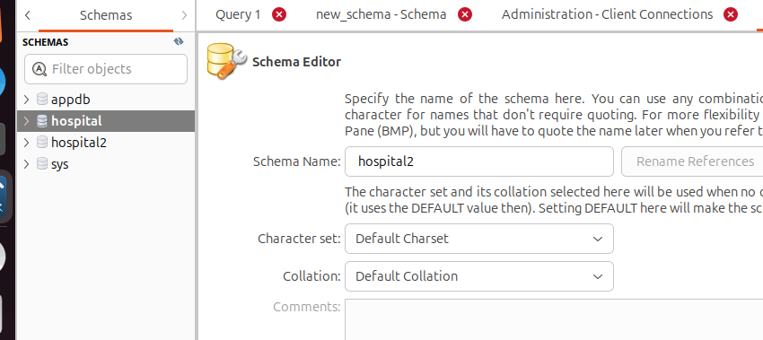

Instalción de PostgreSQl

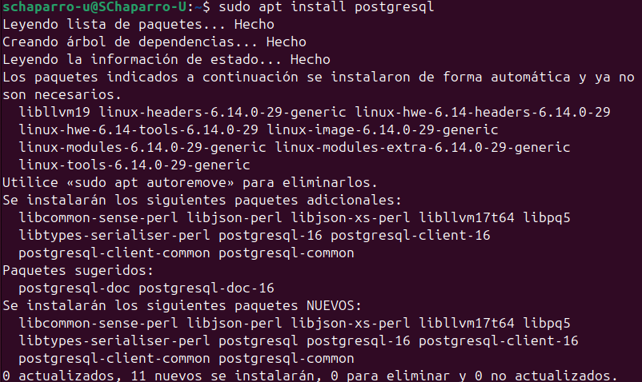
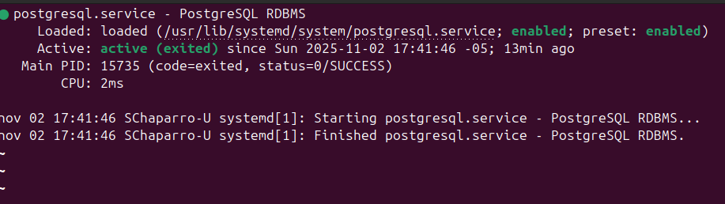

Creación base de datos cli de PostgreSQL

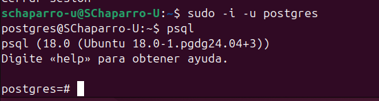
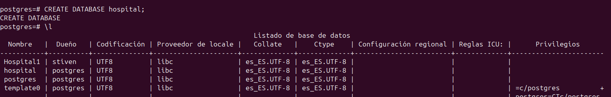
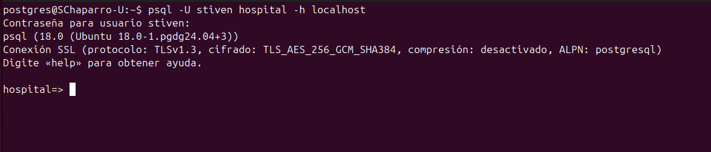

Creacion de base de datos desde PgAdmin

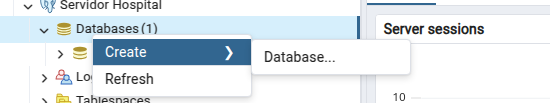
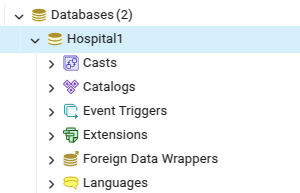

<!--  -->