# Laboratorio 3

Brayan Stiven Chaparro Cataño

### Actividad  #1


### Introducción

Se va a realizar uso de comando DDL para la creación de la base de datos basandonos en el diagrama ER.
Tambien usamos DML para insertar registros a la tabla y hacer uso de los comandos DQL.


### comandos DDL

1. Creación de base de datos.

```sql
CREATE DATABASE ecommerce;
```

2. Creación de tabla `Categorias`.

```sql
CREATE TABLE Categorias(
    categoriaID INT AUTO_INCREMENT PRIMARY KEY,
    nombre VARCHAR(100) NOT NULL,
    descripcion VARCHAR(200) 
);
```

3. Creación de tabla `Productos`.

```sql
CREATE TABLE Productos(
    productoID INT AUTO_INCREMENT PRIMARY KEY,
    nombre VARCHAR(100),
    categoriaID INT NOT NULL,
    cantidad_stock INT,
    descripcion VARCHAR(500), 
    garantia DATE,
    precio DECIMAL(20,2),
    

    FOREIGN KEY (categoriaID) references Categorias(categoriaID)
);
```

4. Creación de tabla `Clientes`.

```sql
CREATE TABLE Clientes(
    clienteID INT AUTO_INCREMENT PRIMARY KEY,
    nombre VARCHAR(100) NOT NULL,
    apellido VARCHAR(100) NOT NULL,
    fecha_nacimiento DATE 
);
```

5. Creación de tabla `Calificaciones`.

```sql
CREATE TABLE Calificaciones(
    calificacionID INT AUTO_INCREMENT PRIMARY KEY,
    valoracion INT NOT NULL,
    comentario VARCHAR(300),
    fecha DATE, 
    productoID INT NOT NULL,
    clienteID INT NOT NULL,
    

    FOREIGN KEY (productoID) references Productos(productoID),
    FOREIGN KEY (clienteID) references Clientes(clienteID)
);
```

6. Creación de tabla `Pedidos`.

```sql
CREATE TABLE Pedidos(
    pedidoID INT AUTO_INCREMENT PRIMARY KEY,
    fecha DATE,
    estado VARCHAR(20),
    total decimal(20, 2) NOT NULL,
    descripcion VARCHAR(100),
    created_at DATE,
    updated_at DATE,
    clienteID INT NOT NULL,
    
    
    FOREIGN KEY (clienteID) references Clientes(clienteID)
);
```

7. Creación de tabla `ProductosPedidos`.

```sql
CREATE TABLE ProductosPedidos(
    producto_pedidoID INT AUTO_INCREMENT PRIMARY KEY,
   
    productoID INT NOT NULL,
    pedidoID INT NOT NULL,
    
    FOREIGN KEY (productoID) references Productos(productoID),
    FOREIGN KEY (pedidoID) references Pedidos(pedidoID)
);
```

8. Creación de tabla `Envios`.

```sql
CREATE TABLE Envios(
    envioID INT AUTO_INCREMENT PRIMARY KEY,
    direccion VARCHAR(100) NOT NULL,
    transportista VARCHAR(100),
    numero_seguimiento VARCHAR(20) NOT NULL UNIQUE,
    fecha_entrega_estimada DATE,
    estado_envio VARCHAR(20) DEFAULT 'En proceso', 

    pedidoID INT NOT NULL,
    

    FOREIGN KEY (pedidoID) references Pedidos(pedidoID),

);
```

Le agrege un valor por defecto al estado del envio que en este caso es `En proceso`.

9. Creación de tabla `telefonos_clientes`.

```sql
CREATE TABLE telefonos_clientes(
    telefonoID INT AUTO_INCREMENT PRIMARY KEY,
    clienteID INT NOT NULL,
    telefono VARCHAR(20) NOT NULL,
    
    FOREIGN KEY (clienteID) references Clientes(clienteID)
);
```


10. Creación de tabla `email_clientes`.

```sql
CREATE TABLE email_clientes(
    emailID INT AUTO_INCREMENT PRIMARY KEY,
    clienteID INT NOT NULL,
    email VARCHAR(100) NOT NULL,
    
    FOREIGN KEY (clienteID) references Clientes(clienteID)
);
```

11. Creación de tabla `direcciones_clientes`.

```sql
CREATE TABLE direcciones_clientes(
    direccionID INT AUTO_INCREMENT PRIMARY KEY,
    clienteID INT NOT NULL,
    direccion VARCHAR(220) NOT NULL,
    
    FOREIGN KEY (clienteID) references Clientes(clienteID)
);
```
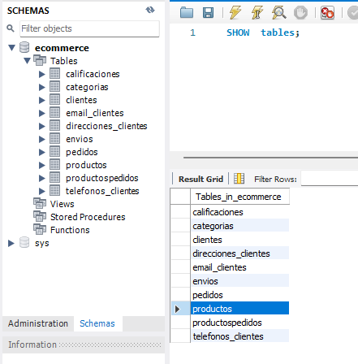

Como resultado de ejecucion de cada de uno de los comandos para crear cada tabla como se aprecia en la imagen se han generado las tablas correspondientes al ejercicio.
Este primer paso no me surgio ninguna dificultad de momento.

### comandos DML

1. insertar datos a la tabla `Categorias`.

```sql
INSERT INTO Categorias (nombre, descripcion)
VALUES
    ('Deportes y Fitness', 'Explora lo mejor en productos y accesorios.'),
    ('Hogar', 'Articulos para la decoración y mantenimiento del hogar.' ),
    ('Tegnologia', 'Encuentra lo ultimo en tegnologia.' ),
    ('Juegos y Juguetes', 'Juegos para todas las edades.' );

```

2. Insertar datos a la tabla `Productos`.

```sql
INSERT INTO Productos (categoriaID, nombre, cantidad_stock, descripción, garantia, precio)
VALUES
    (1,'Colchoneta de Yoga Pro', 23, 'Colchoneta de yoga antideslizante de 6mm de grosor.', '2026-06-30',15.59),
    (2,'Set de 4 Tazas de Cerámica', 80, 'Set de 4 tazas de cerámica para café con acabado brillante.', NULL ,24.99 ),
    (3, 'Audífonos Inalámbricos ANC', 23, 'Audifonos inalámbricos con cancelación de ruido activa.', '2026-12-01', 89.99 ),
    (4, 'Bloques de Construcción Clásicos', 60, 'Bloques de construcción de 500 piezas, compatibles con otras marcas.', NULL, 35.00);

```

3. insertar datos a la tabla `Clientes`.

```sql
INSERT INTO Clientes (nombre, apellido, fecha_nacimiento)
VALUES 
    ('Laura', 'Pérez', '2000-03-20'),
    ('Roberto', 'Sánchez', '2003-11-05'),
    ('Sofía', 'Martínez', '2001-07-18'),
    ('Andrés', 'Gómez', '2000-01-25');
```

4. insertar datos a la tabla `Calificaciones`.

```sql
INSERT INTO Calificaciones (valoracion, comentario, fecha, productoID, clienteID)
VALUES 
    (5, 'Excelente colchoneta, muy cómoda y no se resbala.', '2025-11-10', 1, 1),
    (4, 'Buen sonido, pero la cancelación de ruido podría mejorar un poco.', '2025-11-12', 3, 2),
    (5, 'Un juego perfecto para los niños. ¡Horas de diversión!', '2025-11-13', 4, 3),
    (3, 'Las tazas son bonitas, pero una llegó con un pequeño defecto en el esmalte.', '2025-11-14', 2, 4);
```


5. inserta datos a la tabla `Pedidos`.

```sql
INSERT INTO Pedidos (fecha, estado, total, descripcion, created_at, updated_at, clienteID)
VALUES 
    ('2025-11-10', 'Entregado', 45.99, 'Pedido de ropa deportiva y un libro.', '2025-11-10', '2025-11-14', 1),-- (cliente Laura)
    ('2025-11-12', 'Enviado', 189.98, 'Pedido de audífonos y un cargador.', '2025-11-12', '2025-11-13', 2), -- (cliente Roberto)
    ('2025-11-13', 'Pendiente', 35.00, 'Solo bloques de construcción.', '2025-11-13', '2025-11-13', 3), -- (cliente Sofia)
    ('2025-11-14', 'Cancelado', 24.99, 'Set de tazas para regalo.', '2025-11-14', '2025-11-14', 4); -- (cliente Andres)
```

6. insertar datos a `ProductosPedidos`.

```sql
INSERT INTO ProductosPedidos (productoID, pedidoID)
VALUES 
    (1, 1), -- (laura) pedido 1, producto 1(colchoneta yoga)
    (3, 2), -- (Roberto) pedido 2, Producto 3 (Audífonos)
    (1, 2), -- (Roberto) pedido 3, Producto 1 (colchoneta yoga)
    (4, 3), -- (Sofia) pedido 4, Producto 4 (Bloques)
    (2, 4); -- (Andres) pedido 5, Producto 2 (Tazas)
```


7. inserta datos a `Envios`.

```sql
INSERT INTO Envios (direccion, transportista, numero_seguimiento, fecha_entrega_estimada, estado_envio, pedidoID)
VALUES 

    ('Calle 123, Bogotá', 'FedEx', 'FX1234567890', '2025-11-14', 'Entregado', 1),
    ('Avenida  742, Medellín', 'DHL', 'DHL9876543210', '2025-11-18', 'Enviado', 2), 
    ('Carrera 5 # 32-65, Yopal', 'Correos Rápidos', 'CR000111254', '2025-11-20', DEFAULT, 3); -- El valor por defecto es el estado 'en proceso'
    -- El ultimo ser cancelado no hay registro de envios
```


8. insertar datos a `telefonos_clientes`.

```sql
INSERT INTO telefonos_clientes (clienteID, telefono)
VALUES 
    -- (Laura Pérez)
    (1, '+573105550001'), 
    -- (Roberto Sánchez)
    (2, '+573005550002'),   
    -- (Sofía Martínez)
    (3, '+573205550003'),
    -- (Andrés Gómez)
    (4, '+573155550004'), 
    -- (Laura Pérez) este es un segundo numero de esta cliente ya que para eso se usa esta tabla que permite que un cliente tenga hasta dos o más numero de telefono, depende mucho del modelo de negocio a seguir
    (1, '+576015551234');
```
    

10. insertar datos a `email_clientes`.

```sql
INSERT INTO email_clientes (clienteID, email)
VALUES 
    (1, 'laura.perez@dominio.com'), 
    (2, 'roberto.sanchez@ejemplo.net'),
    (3, 'sofia.martinez@correo.com'),
    (4, 'andres.gomez@mail.org'),
    (2, 'roberto.trabajo@ejemplo.net');
```

10. insertar datos a `direcciones_clientes`.

```sql
INSERT INTO direcciones_clientes (clienteID, direccion)
VALUES 
    (1, 'Calle 123, Bogotá'),
    (2, 'Avenida  742, Medellín'),
    (2, 'calle 134, Medellin'),
    (3, 'Carrera 5 # 32-65, Yopal'),
    (4, 'Carrera 10 #50-74, Bogotá');
```

### Ejercicios

1. `SELECT`.

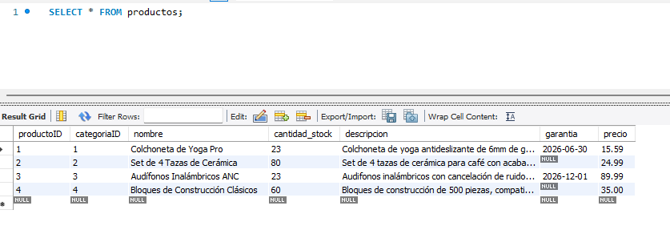

* Agregar la columna `peso` de tipo `Decimal` a la tabla `Productos`.

```sql
ALTER TABLE Productos
ADD COLUMN peso DECIMAL(10, 2) AFTER precio;
```
* Modificar el campo garantia a `DATE`.

*El tipo de dato ya esta presente desde la creción de la tabla.*

* Agregar registros a la columna `peso`.

```sql
UPDATE Productos
SET peso = 1.50  
WHERE productoID = 1;
```

2. Seleccionar `nombre` y `precio` cuyo precio sea mayor a 20 y menor a 50.

```sql
SELECT nombre, precio
FROM Productos
WHERE precio > 20 AND precio < 50;
```
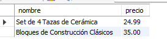

3. Selecciona la `valoración`, `comentario` y `clienteId` de todas las calificaciones de un producto realizadas durante el año actual.

```sql
SELECT valoracion, comentario, clienteID
FROM Calificaciones
WHERE YEAR(2025) 

```

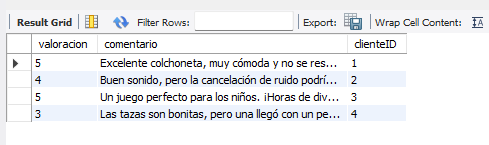

4. Selecciona todos los ~`IDs de pedidos` en los cuales se encuentre un producto determinado

```sql
SELECT pedidoID
FROM ProductosPedidos
WHERE productoID = 1;
```

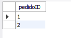

5. Selecciona toda la información de los clientes que sean mayores de edad a la fecha actual.

```sql
SELECT *
FROM Clientes
WHERE CURDATE() >= DATE_ADD(fecha_nacimiento, INTERVAL 18 YEAR);

```

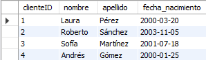

6. Selecciona todos los `teléfonos` de un cliente determinado.

```sql
SELECT *
FROM telefonos_clientes
WHERE clienteID = 1;

```

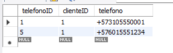

7. Selecciona toda la información de los `envíos` que ya hayan sido `entregados`.

```sql
SELECT *
FROM Envios
WHERE estado_envio = 'Entregado';
```

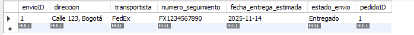

### Conclusión de la actividad #1

El aprender a usar los comandos correctos tanto para creación de tablas usando comando DDL y para la inserción de datos usando comandos DML y por ultimo realizar consultas usando comandos DQL por lo tanto se aprendio la sintaxis de cada uno para realizar los ejercicios propuestos. Ademas de esto se opto por crear una documentación en el readme del repo para tenerlo como notas de lo que realizado.


### Actividad #2


* Diagrama ER de la base de datos `Hospital`

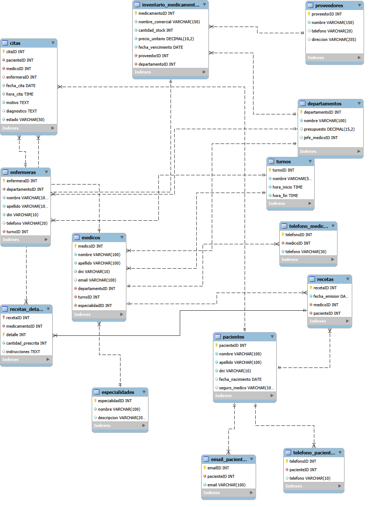

Creación de la tablas
1. `Pacientes`

```sql
CREATE TABLE Pacientes (
   pacienteID INT AUTO_INCREMENT PRIMARY KEY,
   nombre VARCHAR(100) NOT NULL,
   apellido VARCHAR(100) NOT NULL,
   dni INT(100) NOT NULL UNIQUE,
   fecha_nacimiento DATE,
   seguro_medico VARCHAR(100)

);

```

2. `Email_pacientes`

```sql
CREATE TABLE email_pacientes(
    emailID INT AUTO_INCREMENT PRIMARY KEY,
    pacienteID INT NOT NULL,
    email VARCHAR(100) NOT NULL,
    
    FOREIGN KEY (pacienteID) references Pacientes(pacienteID)
);
```

3. `telefono_pacientes`

```sql
CREATE TABLE telefono_pacientes(
    telefonoID INT AUTO_INCREMENT PRIMARY KEY,
    pacienteID INT NOT NULL,
    telefono VARCHAR(100) NOT NULL,
    
    FOREIGN KEY (pacienteID) references Pacientes(pacienteID)
);
```

4. `Departamentos`

```sql
CREATE TABLE Departamentos (
   departamentoID INT AUTO_INCREMENT PRIMARY KEY,
   nombre VARCHAR(100) NOT NULL,
   presupuesto DECIMAL(15,2),
   jefe_medicoID INT,
   UNIQUE KEY (jefe_medicoID)

);

```
5. `Especialidades`

```sql
CREATE TABLE Especialidades (
   especialidadID INT AUTO_INCREMENT PRIMARY KEY,
   nombre VARCHAR(100) NOT NULL,
   descripcion VARCHAR(200)

);

```

6. `Turnos`

```sql
CREATE TABLE Turnos (
    turnoID INT AUTO_INCREMENT PRIMARY KEY,
    nombre VARCHAR(50) NOT NULL UNIQUE, 
    hora_inicio TIME NOT NULL, 
    hora_fin TIME NOT NULL
);

```


7. `Medicos`

```sql
CREATE TABLE Medicos (
    medicoID INT AUTO_INCREMENT PRIMARY KEY,
    nombre VARCHAR(100) NOT NULL,
    apellido VARCHAR(100) NOT NULL,
    dni VARCHAR(10) NOT NULL UNIQUE, 
    email VARCHAR(100) UNIQUE, 
  
    departamentoID INT NOT NULL,
    turnoID INT NOT NULL,
    especialidadID INT NOT NULL,


    FOREIGN KEY (departamentoID) REFERENCES Departamentos(departamentoID),
    FOREIGN KEY (turnoID) REFERENCES Turnos(turnoID),
    FOREIGN KEY (especialidadID) REFERENCES Especialidades(especialidadID) 
);

```

8. `telefono_medicos`

```sql
CREATE TABLE telefono_medicos(
    telefonoID INT AUTO_INCREMENT PRIMARY KEY,
    medicoID INT NOT NULL,
    telefono VARCHAR(100) NOT NULL,
    
    FOREIGN KEY (medicoID) references Medicos(medicoID)
);
```

9. `Emfermeras`

```sql
CREATE TABLE Enfermeras(
    enfermeraID INT AUTO_INCREMENT PRIMARY KEY,
    departamentoID INT NOT NULL,
    nombre VARCHAR(100) NOT NULL,
    apellido VARCHAR(100) NOT NULL,
    dni VARCHAR(10) NOT NULL UNIQUE,
    telefono VARCHAR(20),
    turnoID INT NOT NULL,
    
    FOREIGN KEY (turnoID) REFERENCES Turnos(turnoID),
    FOREIGN KEY (departamentoID) references Departamentos(departamentoID)
);
```

10. `Proveedores`

```sql
CREATE TABLE Proveedores (
    proveedorID INT AUTO_INCREMENT PRIMARY KEY,
    nombre VARCHAR(150) NOT NULL UNIQUE,
    telefono VARCHAR(20),
    direccion VARCHAR(255)
);
```

11. `Inventario_Medicamentos`

```sql
CREATE TABLE Inventario_Medicamentos (
    medicamentoID INT AUTO_INCREMENT PRIMARY KEY,
    nombre_comercial VARCHAR(150) NOT NULL UNIQUE,
    cantidad_stock INT NOT NULL DEFAULT 0,
    precio_unitario DECIMAL(10, 2) NOT NULL,
    fecha_vencimiento DATE NOT NULL,
    
  
    proveedorID INT NOT NULL,
    departamentoID INT NOT NULL,


    FOREIGN KEY (departamentoID) REFERENCES Departamentos(departamentoID),
    FOREIGN KEY (proveedorID) REFERENCES Proveedores(proveedorID)
);
```
12. `Recetas`
```sql
CREATE TABLE Recetas (
    recetaID INT AUTO_INCREMENT PRIMARY KEY,
    fecha_emision DATE NOT NULL,
    medicoID INT NOT NULL,
    pacienteID INT NOT NULL,
    
    FOREIGN KEY (medicoID) REFERENCES Medicos(medicoID),
    FOREIGN KEY (pacienteID) REFERENCES Pacientes(pacienteID)
);
```

13. `Detalle_receta`

```sql
CREATE TABLE Recetas_Detalle (
    recetaID INT NOT NULL,
    medicamentoID INT NOT NULL,
    detalle INT NOT NULL, 
    cantidad_prescrita INT NOT NULL,
    instrucciones TEXT,
    
   
    PRIMARY KEY (recetaID, detalle), 
    
    FOREIGN KEY (recetaID) REFERENCES Recetas(recetaID),
    FOREIGN KEY (medicamentoID) REFERENCES Inventario_Medicamentos(medicamentoID)
);
```

13. `Detalle_receta`

```sql
CREATE TABLE Citas (
    citaID INT AUTO_INCREMENT PRIMARY KEY,
    pacienteID INT NOT NULL,
    medicoID INT NOT NULL,
    enfermeraID INT, 
    
    fecha_cita DATE NOT NULL,
    hora_cita TIME NOT NULL,
    motivo TEXT NOT NULL, 
    diagnostico TEXT,
    
    estado VARCHAR(50) NOT NULL DEFAULT 'Programada', 
    
    FOREIGN KEY (pacienteID) REFERENCES Pacientes(pacienteID),
    FOREIGN KEY (medicoID) REFERENCES Medicos(medicoID),
    FOREIGN KEY (enfermeraID) REFERENCES Enfermeras(enfermeraID)
);
```


### Ejercicios

1. Mostrar los pacientes cuya edad está entre 30 y 50 años

En este caso se usa una función para que tome la fecha de nacimiento hasta el dia de hoy y asi nos de la edad que corresponde.

 ```sql
 SELECT 
    pacienteID, 
    nombre, 
    apellido, 
    fecha_nacimiento,
    TIMESTAMPDIFF(YEAR, fecha_nacimiento, CURDATE()) AS edad_actual
FROM Pacientes
WHERE 
    TIMESTAMPDIFF(YEAR, fecha_nacimiento, CURDATE()) BETWEEN 30 AND 50;
 ```

 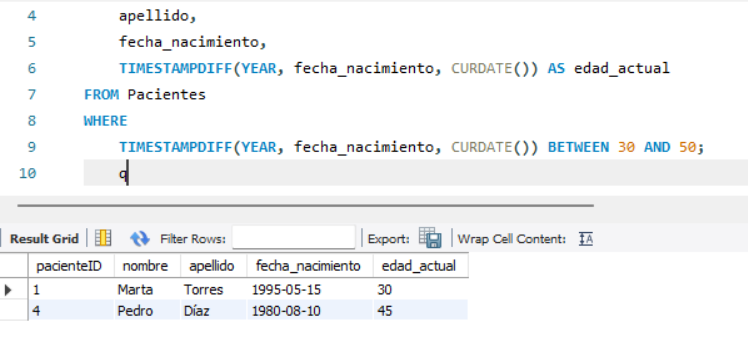


2. Mostrar las citas que aún no han sido concluidas

```sql
SELECT *
FROM Citas
WHERE estado = 'Programada' OR estado = 'Pendiente';
```

 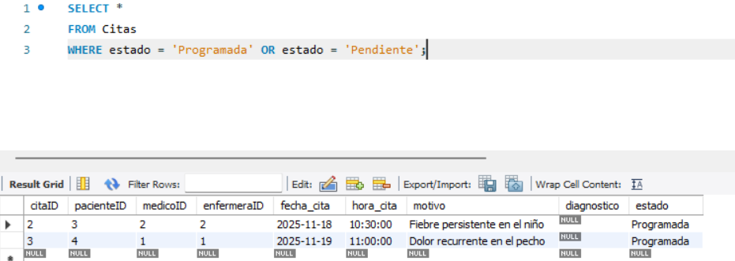

3. Modificar una tabla para agregar una columna `email` a `Pacientes`


Inicialmente ya habia agregado ese valor en una tabla multivaluado.

### Conclusion actividad #2 

Basandonos en lo aprendido en el laboratorio uno se volvio a usar comandos similares pero esta vez se tenia en cuenta los nuevos requerimientos, y también aprendi a usar una función sql para calcular la edad de un usuario usando e valor de la columna `fecha_nacimiento` y tambien el concepto del tipo de dato `TIME`.

Algunas dificultades que presente fue que en las tablas donde requeria dni al inicio cuando las cree no le habia agregado esta columna pero lo solucione gracias a que este mismo problema me habias sucedido en la actividad uno y lo habia documentado y solo use el comando.