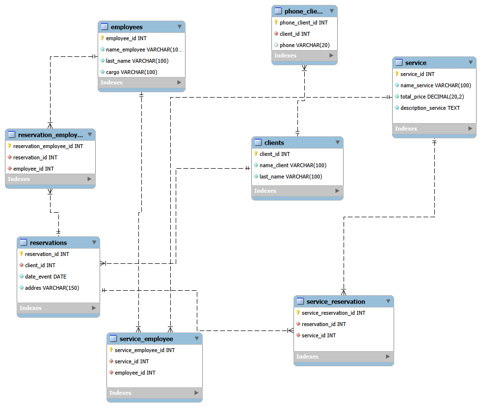

# Laboratorio 3

Brayan Stiven Chaparro Cataño

### Actividad  #1


### Introducción

En esta actividad se va aplicar la reglas de formalización a una base de datos que contiene demasiadas redundancias, y tambien una vez finalizado crear la db corresponidente y sus tablas y generar el Diagrama ER.

### comandos DDL

1. Creación de base de datos.

```sql
CREATE DATABASE store;
```

2. Creación de tabla `Productos`.

```sql
CREATE TABLE Products(
    product_id INT AUTO_INCREMENT PRIMARY KEY,
    name_product VARCHAR(100) NOT NULL,
    unit_price Decimal(20,2)
);
```

3. Creación de tabla `Banco`.

```sql
CREATE TABLE Banks(
    bank_id INT AUTO_INCREMENT PRIMARY KEY,
    name_bank VARCHAR(100)
    
);
```

4. Creación de tabla `Clientes`.

```sql
CREATE TABLE Clients(
    client_id INT AUTO_INCREMENT PRIMARY KEY,
    name_client VARCHAR(100) NOT NULL,
    last_name VARCHAR(100) NOT NULL
);
```

5. Creación de tabla `Tarjeta`.

```sql
CREATE TABLE Cards(
    number_card VARCHAR(16) PRIMARY KEY,
    bank_id INT NOT NULL,
    client_id INT NOT NULL,
    

    FOREIGN KEY (bank_id) references Banks(bank_id),
    FOREIGN KEY (client_id) references Clients(client_id)
);
```

6. Creación de tabla `Ordenes`.

```sql
CREATE TABLE Orders (

    order_number INT PRIMARY KEY, 
    client_id INT NOT NULL,
    number_card VARCHAR(16) NOT NULL,
    date_order DATE NOT NULL,
    total_price DECIMAL(10, 2) NOT NULL,
  
    FOREIGN KEY (client_id) REFERENCES Clients(client_id),
    FOREIGN KEY (number_card) REFERENCES Cards(number_card)
);
```

7. Creación de tabla `Detalle orden`.

```sql
CREATE TABLE detail_order (
    
    order_number INT NOT NULL, 
    product_id INT NOT NULL,
    quantity INT NOT NULL,
    
    PRIMARY KEY (order_number, product_id), -- Uso de clave compuesta
    
   
    FOREIGN KEY (order_number) REFERENCES Orders(order_number),
    FOREIGN KEY (product_id) REFERENCES Products(product_id)
);
```

Como resultado de la normalización y una ves llegado a la FN3.


### Conclusión actividad 1

El identificar cada uno de los pasos que se lleva en una base de datos que al inicio contiene muchos elementos que son redundante y como aplicanco las reglas de normalizacion podemos eliminar esta redundancia o minimizar. 


### Actividad 2

### Introducción

Realizar el mismo ejercicio que en la actividad uno pero esta vez con un ejercicio más complejo  para la empresa "Eventos Creativos S.R.L." se dedica a organizar eventos corporativos, bodas, lanzamientos de productos y conferencias. Tiene una base de datos que usan para registrar reservas, los servicios contratados (como catering, sonido, decoración), los empleados asignados al evento y los clientes que los contratay teniendo en cuenta la FN1, FN2, FN3.

### comandos DDL

1. Creación de base de datos.

```sql
CREATE DATABASE events;
```

2. Creación de tabla `clientes`.

```sql
CREATE TABLE Clients(
    client_id INT AUTO_INCREMENT PRIMARY KEY,
    name_client VARCHAR(100) NOT NULL,
    last_name VARCHAR(100) NOT NULL
    
);
```

3. Creación de tabla `telefono cliente`.

```sql
CREATE TABLE phone_clients(
    phone_client_id INT AUTO_INCREMENT PRIMARY KEY,
    client_id INT NOT NULL,
    phone VARCHAR(20),
    
    FOREIGN KEY (client_id) references Clients(client_id)
);
```

4. Creación de tabla `Empleado`.

```sql
CREATE TABLE Employees(
    employee_id INT AUTO_INCREMENT PRIMARY KEY,
    name_employee VARCHAR(100) NOT NULL,
    last_name VARCHAR(100) NOT NULL,
    cargo VARCHAR(100) NOT NULL
);
```

5. Creación de tabla `Servicio`.

```sql
CREATE TABLE Service(
    service_id INT AUTO_INCREMENT PRIMARY KEY,
    name_service VARCHAR(100) NOT NULL,
    total_price DECIMAL(20,2) NOT NULL,
    description_service TEXT NOT NULL

   
);
```

6. Creación de tabla `Reserva`.

```sql
CREATE TABLE Reservations (

    reservation_id INT AUTO_INCREMENT PRIMARY KEY,
    client_id INT NOT NULL,
    date_event DATE NOT NULL,
    addres VARCHAR(150)NOT NULL,
  
    FOREIGN KEY (client_id) REFERENCES Clients(client_id),
);
```

7. Creación de tabla `Servicio Empleado o asignacion de empleado`.

```sql
CREATE TABLE service_employee (
    service_employee_id INT AUTO_INCREMENT PRIMARY KEY, 
    service_id INT NOT NULL,
    employee_id INT NOT NULL,
    UNIQUE KEY (service_id, employee_id),

    FOREIGN KEY (service_id) REFERENCES Service(service_id),
    FOREIGN KEY (employee_id) REFERENCES Employees(employee_id)
);
```

8. Creación de tabla `Servicios contratados o reservados`.

```sql
CREATE TABLE service_reservation (
    service_reservation_id INT AUTO_INCREMENT PRIMARY KEY, 
    reservation_id INT NOT NULL,
    service_id INT NOT NULL,
    UNIQUE KEY (reservation_id, service_id),
     
    FOREIGN KEY (service_id) REFERENCES Service(service_id),
    FOREIGN KEY (reservation_id) REFERENCES Reservations(reservation_id)
);
```

9. Creación de tabla `Empleados que estan a cargo de ofrecer el servicio en el evento o reservacion`.

```sql
CREATE TABLE reservation_employee (
    
    reservation_employee_id INT AUTO_INCREMENT PRIMARY KEY, 
    
    reservation_id INT NOT NULL,
    employee_id INT NOT NULL,
    

    UNIQUE KEY (reservation_id, employee_id), 
    
    FOREIGN KEY (reservation_id) REFERENCES Reservations(reservation_id),
    FOREIGN KEY (employee_id) REFERENCES Employees(employee_id)
);
```
Como resultado de la normalización y una ves llegado a la FN3.



### Conclusión

Al realizar el ejercicio aunque durante el proceso tuve inconvenientes tratando de entender el ejercicio y sobre todo si agregar el tema de asignar cargos en una tabla pero al final logre hacerlo de tal forma que este se entienda mejor.


