# Laboratorio 5

Brayan Stiven Chaparro Cataño

### Actividad  #1

### Introducción

Iniciar con el la creacion de la base de datos y realizar pruebas correspondientes para probar que se haya instalado correctamente y hacer uso de comandos para realizar las consultas que nos exigue el ejercicio.


### Ejercicios practicos

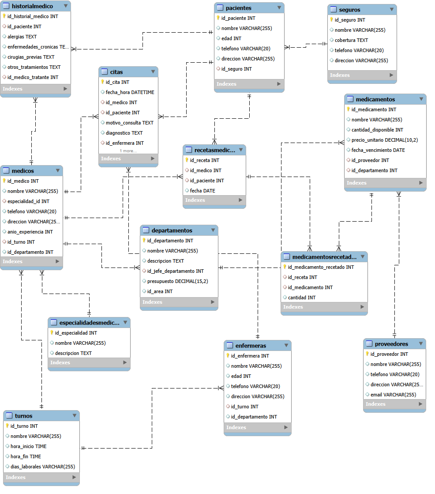


1. Listar todos los médicos registrados.

```sql
SELECT *
FROM medicos;

```
2. Mostrar el nombre y edad de todas las enfermeras.


```sql
SELECT nombre, edad
FROM enfermeras;

```

3. Obtener el nombre y teléfono de los pacientes que viene en la ciudad de Bogotá.

```sql
SELECT nombre, telefono 
FROM pacientes
WHERE direccion LIKE '%Bogotá%'; --  filtro condicional: % % contenga la cadena de texto "Bogotá" en cualquier parte.
```

4. Listar el nombre y precio unitario de todos los medicamentos ordenados del más barato al más caro.

```sql
SELECT nombre, precio_unitario
FROM medicamentos
ORDER BY precio_unitario ASC;
```

5. Mostrar los nombres de los seguros disponibles

```sql
SELECT nombre
FROM seguros;
```


### Ejercicios

1. 

```sql
INSERT INTO Pacientes(id_paciente, nombre, edad, telefono, direccion, id_seguro)
VALUES
(32, 'Stiven Chaparro', 15, '+5712345678', 'Carrera 34 #20-50, Bogotá', 3)
;
```


2. 

```sql
SELECT E.nombre AS especialidad,
       COUNT(M.id_medico) AS medicos
FROM Medicos M
JOIN EspecialidadesMedicas E ON M.especialidad_id = E.id_especialidad
GROUP BY E.nombre
ORDER BY medicos DESC;
```
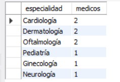

3. 

```sql
SELECT
    D.nombre AS Departamento,
    COUNT(M.id_medico) AS Total_Medicos_Mas_10_Anios,
    MAX(M.anio_experiencia) AS Antiguedad_Depto
FROM
    Medicos M
JOIN
    Departamentos D ON M.id_departamento = D.id_departamento
WHERE
    M.anio_experiencia >= 10 
GROUP BY
    D.nombre 
ORDER BY
    Antiguedad_Depto DESC

```
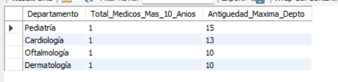

4. 
```sql
SELECT
    D.nombre AS Departamento,
    D.presupuesto AS Presupuesto_Actual,
    (SELECT AVG(presupuesto) FROM Departamentos) AS Promedio_General,
    CASE
        WHEN D.presupuesto > (SELECT AVG(presupuesto) FROM Departamentos) THEN 'Mayor al Promedio'
        WHEN D.presupuesto < (SELECT AVG(presupuesto) FROM Departamentos) THEN 'Menor al Promedio'
        ELSE 'Igual al Promedio'
    END AS Estate
FROM
    Departamentos D
ORDER BY
    D.presupuesto DESC;
```
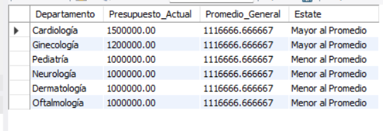

5. 
```sql
SELECT d.nombre AS departamento, d.presupuesto, COUNT(m.id_medico) AS cantidad_medicos
FROM Departamentos d
LEFT JOIN Medicos m ON d.id_departamento = m.id_departamento
GROUP BY d.id_departamento, d.nombre, d.presupuesto
ORDER BY d.presupuesto ASC
LIMIT 2;
```
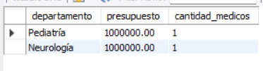

6. 
```sql
SELECT
    '0-18 años (Niños/Adolescentes)' AS Grupo_Edad,
    COUNT(id_paciente) AS Total_Pacientes
FROM
    Pacientes
WHERE
    edad BETWEEN 0 AND 18

UNION ALL

SELECT
    '19-35 años (Adultos Jóvenes)' AS Grupo_Edad,
    COUNT(id_paciente) AS Total_Pacientes
FROM
    Pacientes
WHERE
    edad BETWEEN 19 AND 35

UNION ALL

SELECT
    '36-60 años (Adultos Maduros)' AS Grupo_Edad,
    COUNT(id_paciente) AS Total_Pacientes
FROM
    Pacientes
WHERE
    edad BETWEEN 36 AND 60

UNION ALL

SELECT
    'Más de 60 años (Adultos Mayores)' AS Grupo_Edad,
    COUNT(id_paciente) AS Total_Pacientes
FROM
    Pacientes
WHERE
    edad > 60; -- En mi caso aun no tengo un paciente mayor de 60 
```
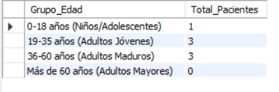

7. 
```sql
SELECT
(AVG(CASE
	WHEN id_seguro = 2 THEN 1
	ELSE 0
END) * 100) AS porcentaje_seguro2
FROM Pacientes;
```
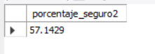

8. 
```sql
SELECT
    M.id_medico AS ID_Medico,
    M.nombre AS Nombre_Medico
FROM
    Medicos M
LEFT JOIN
    Citas C ON M.id_medico = C.id_medico
WHERE
    C.id_cita IS NULL;
```
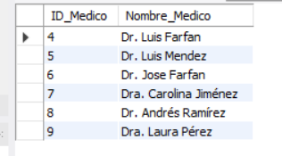

9. 
```sql

SELECT
    D.nombre AS nombre_departamento,
    COUNT(M.id_medico) AS cantidad_medicos
FROM Departamentos D
JOIN Medicos M ON D.id_departamento = M.id_departamento
GROUP BY D.id_departamento, D.nombre
HAVING COUNT(M.id_medico) > 1 
ORDER BY cantidad_medicos DESC; 
```

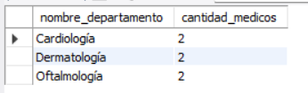

10. No se realizo.
 

11. 
```sql
SELECT
    M.nombre AS Nombre_Medico,
    M.id_medico AS ID_Medico,
    C.id_cita AS ID_Cita_Asignada,
    C.fecha_hora AS Fecha_Hora_Cita
FROM
    Medicos M
LEFT JOIN
    Citas C ON M.id_medico = C.id_medico
ORDER BY
    m.id_medico ASC;
```
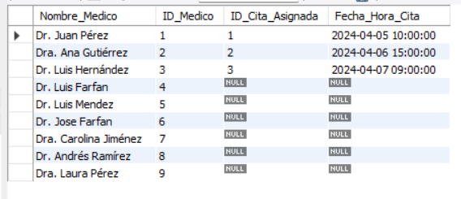

12. 
```sql
SELECT
    D.nombre AS Nombre_Departamento,
    D.id_departamento AS ID_Departamento,
    M.nombre AS Nombre_Medico,
    M.id_medico AS ID_Medico
FROM
    Departamentos D
LEFT JOIN
    Medicos M ON D.id_departamento = M.id_departamento
ORDER BY
    D.nombre ASC, M.nombre ASC;
```
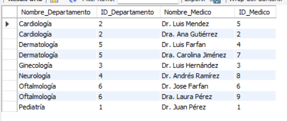

13. 
```sql
SELECT
    COUNT(id_cita) AS Total_Citas_Ultimos_6_Meses
FROM
    Citas
WHERE
    fecha_hora >= DATE_SUB(CURDATE(), INTERVAL 6 MONTH);
```
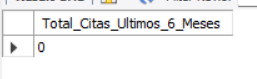

14. 
```sql
SELECT
    D.nombre AS Departamento,
    COUNT(C.id_cita) AS Total_Citas_Registradas
FROM
    Departamentos D
JOIN
    Medicos M ON D.id_departamento = M.id_departamento
JOIN
    Citas C ON M.id_medico = C.id_medico
GROUP BY
    D.nombre
ORDER BY
    Total_Citas_Registradas DESC
LIMIT 1;
```


15. 
```sql
SELECT
    M.nombre AS Nombre_Medico,
    E.nombre AS Especialidad,
    COUNT(C.id_cita) AS Total_Citas_Atendidas
FROM
    Medicos M
JOIN
    Citas C ON M.id_medico = C.id_medico
JOIN
    EspecialidadesMedicas E ON M.especialidad_id = E.id_especialidad
GROUP BY
    M.id_medico, M.nombre, E.nombre 
ORDER BY
    Total_Citas_Atendidas DESC
LIMIT 1;
```


16. 
```sql
SELECT
    P.nombre AS Nombre_Paciente,
    COUNT(C.id_cita) AS Total_Citas_Realizadas
FROM
    Pacientes P
JOIN
    Citas C ON P.id_paciente = C.id_paciente
GROUP BY
    P.id_paciente, P.nombre
ORDER BY
    Total_Citas_Realizadas DESC
LIMIT 1;
```


### Conclusión
 
Despues de realizado cada una de la consultas se ha aprendido a usar nuevas  funciones de agregación como COUNT(), SUM(), AVG(), y a combinarlas con las cláusulas GROUP BY y HAVING para obtener los resultados esperado por el laboratorio.