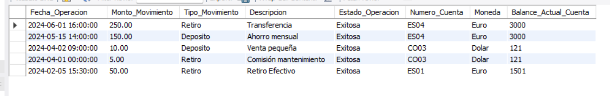
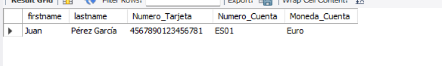
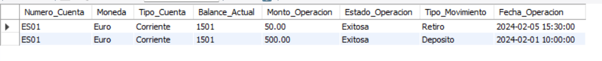
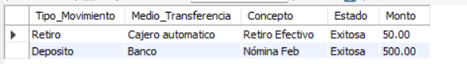
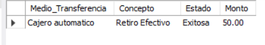
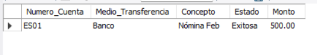
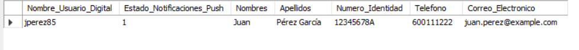
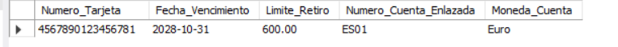

 # Laboratorio 6

Brayan Stiven Chaparro Cataño

### Actividad  #1


### Introducción

En esta actividad se va realizar la creacion de la base de datos para un banco y despues realizar una serie de consultas, la creación de la base de datos se debe de tener en cuenta los requerimientos del cliente.


1. Creación db `Banco`

```sql
   CREATE DATABASE banco
```

 
2. Creación tabla ``Clientes`
 
```sql

 CREATE TABLE clients (
  client_id INT AUTO_INCREMENT PRIMARY KEY,
  dni VARCHAR(20) UNIQUE, -- Para evitar clientes repetidos
  firstname VARCHAR(100) NOT NULL,
  lastname VARCHAR(100) NOT NULL,
  sex VARCHAR(1), -- F y M
  date_bird DATE NOT NULL,
  country_resindece VARCHAR(50) NOT NULL,
  city_residence VARCHAR(50) NOT NULL,
  phone VARCHAR(20) NOT NULL,
  email VARCHAR(100) UNIQUE NOT NULL

);

```

Agregar UNIQUE al dni y email para que no me permita insertar usuarios con el mismo dni.

3. tabla `cuentas`


```sql

CREATE TABLE accounts (
  num_account VARCHAR(20)  PRIMARY KEY, -- Número de cuenta
  client_id INT NOT NULL,
  balance DECIMAL(15.2),
  opening_date DATE NOT NULL,
  state_account VARCHAR(50) NOT NULL DEFAULT 'Activa', -- 'Activa' o 'Inactiva'
  coin VARCHAR(10) NOT NULL, -- 'Euro'o 'Dolar'
  type_account VARCHAR(20) NOT NULL, -- 'Corriente' o 'Caja de ahorro'
  FOREIGN KEY (client_id) REFERENCES Clients(client_id)

);

```

3. tabla `historial_cuenta`


```sql

CREATE TABLE accounts_history (
  history_id INT AUTO_INCREMENT PRIMARY KEY,
  num_account VARCHAR(20) NOT NULL, -- Numero cuenta
  transaction_date DATETIME NOT NULL,
  amount DECIMAL(15, 2) NOT NULL,
  type_movement VARCHAR(20) NOT NULL, -- 'Deposito' o 'Retiro'
  medium_transfer VARCHAR(20) NOT NULL, -- 'Banco', 'Online', 'Cajero automatico'
  description_movement VARCHAR(200),
  state_operation VARCHAR(10) NOT NULL, -- 'Pendiente', 'Fallida' o 'Exitosa'


  FOREIGN KEY (num_account) REFERENCES accounts(num_account)

);

```

4. tabla `tarjetas`


```sql

CREATE TABLE cards (

  num_card VARCHAR(16) PRIMARY KEY,
  client_id INT NOT NULL, -- Numero cuenta
  code_security VARCHAR(4) NOT NULL,
  expiration_date DATE NOT NULL,
  password_hash VARCHAR(255) NOT NULL,
  retire_limmit DECIMAL(10,2) NOT NULL,


  FOREIGN KEY (client_id) REFERENCES clients(client_id)

);

```

4. tabla `tarjeta cuentas`

```sql

CREATE TABLE card_account (

  num_card VARCHAR(16) NOT NULL,
  num_account VARCHAR(20) , -- Número de cuenta
  state_link  VARCHAR(10), -- 'activo', 'inactivo'
  PRIMARY KEY (num_card, num_account),

  FOREIGN KEY (num_card) REFERENCES cards(num_card),
  FOREIGN KEY (num_account) REFERENCES accounts(num_account)

);

```
5. tabla `usuario banco digital`

```sql

CREATE TABLE user_bank (

  client_id INT PRIMARY KEY,
  name_user VARCHAR(50) UNIQUE NOT NULL,
  password_hash VARCHAR(255) NOT NULL,
  state_push BOOLEAN NOT NULL DEFAULT TRUE,

  FOREIGN KEY (client_id) REFERENCES Clients(client_id)

);
```

### Insersiones

```sql
-- Tabla clientes

INSERT INTO clients (dni, firstname, lastname, sex, date_bird, country_resindece, city_residence, phone, email) VALUES
('12345678A', 'Juan', 'Pérez García', 'M', '1985-05-20', 'España', 'Madrid', '600111222', 'juan.perez@example.com'),
('98765432B', 'María', 'López Ruiz', 'F', '1992-11-10', 'México', 'CDMX', '5512345678', 'maria.lopez@email.mx'),
('54321098C', 'Carlos', 'Jiménez Soto', 'M', '1978-01-25', 'Colombia', 'Bogotá', '3109876543', 'carlos.jimenez@col.com'),
('11223344D', 'Ana', 'Torres Nieto', 'F', '2000-08-15', 'España', 'Barcelona', '677889900', 'ana.torres@bcn.es'),
('44332211E', 'Pedro', 'Gómez Fdez', 'M', '1965-03-01', 'Chile', 'Santiago', '987654321', 'pedro.gomez@chile.cl');

-- Tabla cuenta

INSERT INTO accounts (num_account, client_id, balance, opening_date, coin, type_account) VALUES
('ES01', 1, 150.50, '2024-01-15', 'Euro', 'Corriente'),
('MX02', 2, 500.00, '2023-10-01', 'Dolar', 'Caja de ahorro'),
('CO03', 3, 120.75, '2024-03-20', 'Dolar', 'Corriente'),
('ES04', 4, 300.00, '2024-05-10', 'Euro', 'Caja de ahorro'),
('CL05', 5, 800.00, '2023-08-22', 'Dolar', 'Corriente');

-- Tabla tarjetas

INSERT INTO cards (num_card, client_id, code_security, expiration_date, password_hash, retire_limmit) VALUES
('4567890123456781', 1, '1111', '2028-10-31', 'hash_juan_p', 600.00),
('4567890123456782', 2, '2222', '2027-05-15', 'hash_maria_l', 500.00),
('4567890123456783', 3, '3333', '2029-01-20', 'hash_carlos_j', 400.00),
('4567890123456784', 4, '4444', '2026-07-01', 'hash_ana_t', 750.00),
('4567890123456785', 5, '5555', '2028-03-01', 'hash_pedro_g', 500.00);

-- Tabla vinculacion tarjetas con cuenta principal

INSERT INTO card_account (num_card, num_account, state_link) VALUES
('4567890123456781', 'ES01', 'activo'),
('4567890123456782', 'MX02', 'activo'),
('4567890123456783', 'CO03', 'activo'),
('4567890123456784', 'ES04', 'activo'),
('4567890123456785', 'CL05', 'activo');

-- Tabla usuario banca digital

INSERT INTO user_bank (client_id, name_user, password_hash, state_push) VALUES
(1, 'jperez85', 'hash_online_1', TRUE),
(2, 'mlopez92', 'hash_online_2', TRUE),
(3, 'cjimenez78', 'hash_online_3', FALSE),
(4, 'atorres00', 'hash_online_4', TRUE),
(5, 'pgomez65', 'hash_online_5', FALSE);


-- Tabla historial transacciones

INSERT INTO accounts_history (num_account, transaction_date, amount, type_movement, medium_transfer, description_movement, state_operation) VALUES
('ES01', '2024-02-01 10:00:00', 500.00, 'Deposito', 'Banco', 'Nómina Feb', 'Exitosa'),
('ES01', '2024-02-05 15:30:00', 50.00, 'Retiro', 'Cajero automatico', 'Retiro Efectivo', 'Exitosa'),
('MX02', '2023-11-01 08:00:00', 100.00, 'Deposito', 'Online', 'Transferencia amigo', 'Exitosa'),
('MX02', '2023-11-15 12:00:00', 20.00, 'Retiro', 'Online', 'Pago Spotify', 'Exitosa'),
('CO03', '2024-04-01 00:00:00', 5.00, 'Retiro', 'Online', 'Comisión mantenimiento', 'Exitosa'),
('CO03', '2024-04-02 09:00:00', 10.00, 'Deposito', 'Online', 'Venta pequeña', 'Exitosa'),
('ES04', '2024-05-15 14:00:00', 150.00, 'Deposito', 'Banco', 'Ahorro mensual', 'Exitosa'),
('ES04', '2024-06-01 16:00:00', 250.00, 'Retiro', 'Online', 'Transferencia', 'Exitosa'),
('CL05', '2023-09-01 11:00:00', 30.00, 'Deposito', 'Banco', 'Ingreso Extra', 'Exitosa'),
('CL05', '2023-09-10 13:00:00', 10.00, 'Retiro', 'Cajero automatico', 'Café', 'Exitosa');
```


### Consultas

1. 

```sql

SELECT
    h.transaction_date AS Fecha_Operacion,
    h.amount AS Monto_Movimiento,
    h.type_movement AS Tipo_Movimiento,
    h.description_movement AS Descripcion,
    h.state_operation AS Estado_Operacion,
    a.num_account AS Numero_Cuenta,
    a.coin AS Moneda,
    a.balance AS Balance_Actual_Cuenta -- El balance actual de la cuenta
FROM
    accounts_history h
JOIN
    accounts a ON h.num_account = a.num_account
ORDER BY
    h.transaction_date DESC 
LIMIT 5;

```



2. 

```sql
SELECT
    C.firstname,
    C.lastname,
    CRD.num_card AS Numero_Tarjeta,
    A.num_account AS Numero_Cuenta,
    A.coin AS Moneda_Cuenta
FROM
    cards CRD
JOIN
    clients C ON CRD.client_id = C.client_id  -- Obtiene el nombre del cliente
JOIN
    card_account CA ON CRD.num_card = CA.num_card -- Vincula la tarjeta con la cuenta
JOIN
    accounts A ON CA.num_account = A.num_account -- Obtiene detalles de la cuenta (moneda)
WHERE
    CRD.num_card = '4567890123456781';

```



3. 

```sql
SELECT
    A.num_account AS Numero_Cuenta,
    A.coin AS Moneda,
    A.type_account AS Tipo_Cuenta,
    A.balance AS Balance_Actual,
    ah.amount AS Monto_Operacion,
    ah.state_operation AS Estado_Operacion,
    ah.type_movement AS Tipo_Movimiento,
    ah.transaction_date AS Fecha_Operacion
FROM
    accounts A
JOIN
    accounts_history ah ON A.num_account = ah.num_account
WHERE
    A.num_account = 'ES01' -- el número de cuenta 
ORDER BY
    ah.history_id DESC; 
```




4. 

```sql
SELECT
    type_movement AS Tipo_Movimiento,
    medium_transfer AS Medio_Transferencia,
    description_movement AS Concepto,
    state_operation AS Estado,
    amount AS Monto
FROM
    accounts_history
WHERE
    num_account = 'ES01' 
    AND amount BETWEEN 50.00 AND 500.00 -- rango 
ORDER BY
    transaction_date DESC;

```



5. 

```sql
SELECT
    medium_transfer AS Medio_Transferencia,
    description_movement AS Concepto,
    state_operation AS Estado,
    amount AS Monto
FROM
    accounts_history
WHERE
    num_account = 'ES01'
    AND type_movement = 'Retiro' 
ORDER BY
    transaction_date DESC;

```



6. 

```sql
SELECT
    num_account AS Numero_Cuenta,
    medium_transfer AS Medio_Transferencia,
    description_movement AS Concepto,
    state_operation AS Estado,
    amount AS Monto
FROM
    accounts_history
WHERE
    num_account = 'ES01'  
    AND state_operation = 'Exitosa' 
    AND amount > 100.00 
ORDER BY
    transaction_date DESC;

```


7. 

```sql
SELECT
    UB.name_user AS Nombre_Usuario_Digital, -- UB,usuario banco
    UB.state_push AS Estado_Notificaciones_Push,
    C.firstname AS Nombres,
    C.lastname AS Apellidos,
    C.dni AS Numero_Identidad,
    C.phone AS Telefono,
    C.email AS Correo_Electronico
FROM
    user_bank UB
JOIN
    clients C ON UB.client_id = C.client_id
WHERE
    UB.client_id = 3;

```


En este caso el resultado de la notificacion es 1 ya que use el tipo BOOLEAN por lo que el número (1) es true, falso (0).

8. 

```sql
SELECT
    C.num_card AS Numero_Tarjeta,
    C.expiration_date AS Fecha_Vencimiento,
    C.retire_limmit AS Limite_Retiro,
    A.num_account AS Numero_Cuenta_Enlazada,
    A.coin AS Moneda_Cuenta
FROM
    cards C
JOIN
    card_account CA ON C.num_card = CA.num_card -- Conecta la tarjeta con las cuentas enlazadas
JOIN
    accounts A ON CA.num_account = A.num_account -- Obtiene los detalles (número y moneda) de las cuentas
WHERE
    C.num_card = '4567890123456781';

```



### Conclusion

Despues de realizado la creación de base de datos y al realizar alguna pruebas de insercion de clientes pero en la creacion de la tabla clientes se me paso el modelo de que un cliente debe de ser unico y no se puede repetir la solucion que obtuve fue agregar que el dni y email fueran unicos para asi evitar registros duplicados, se logro correctamente las consultas con uso de JOIN y as para darle nombre al encabezado de la tabla que se muestra una vez se hace la consulta. 