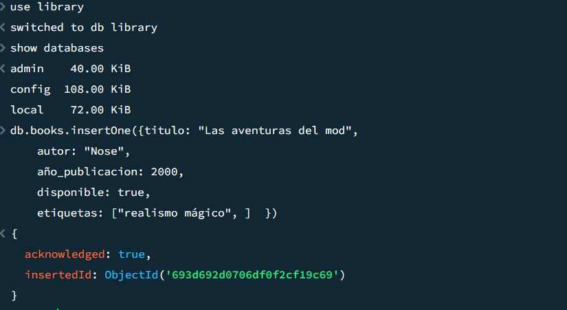
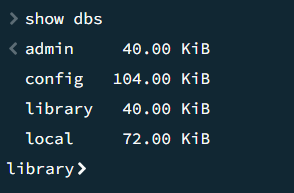
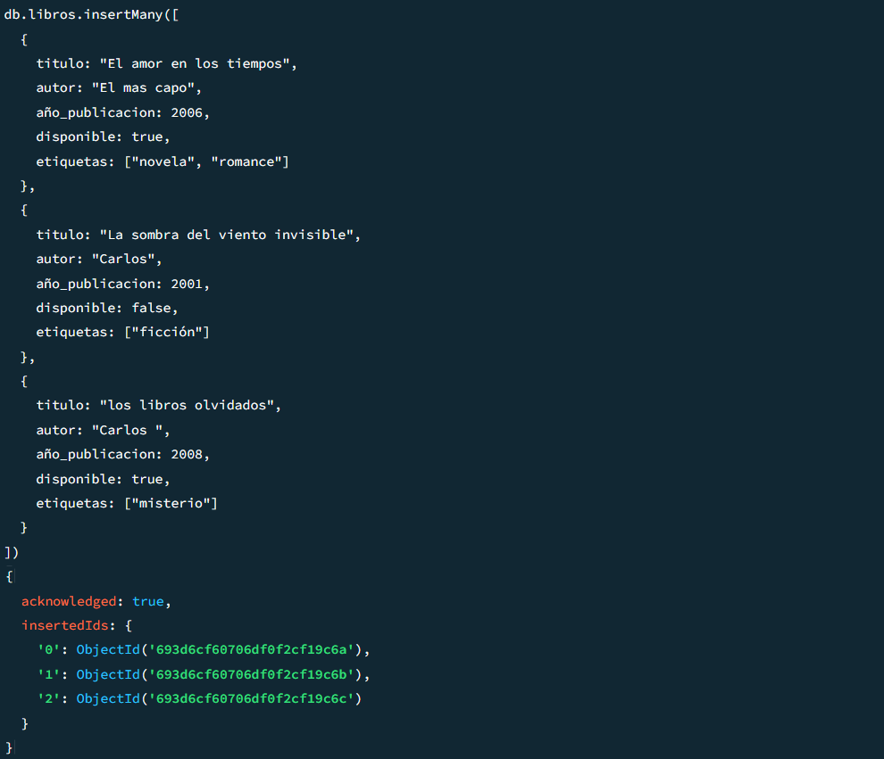
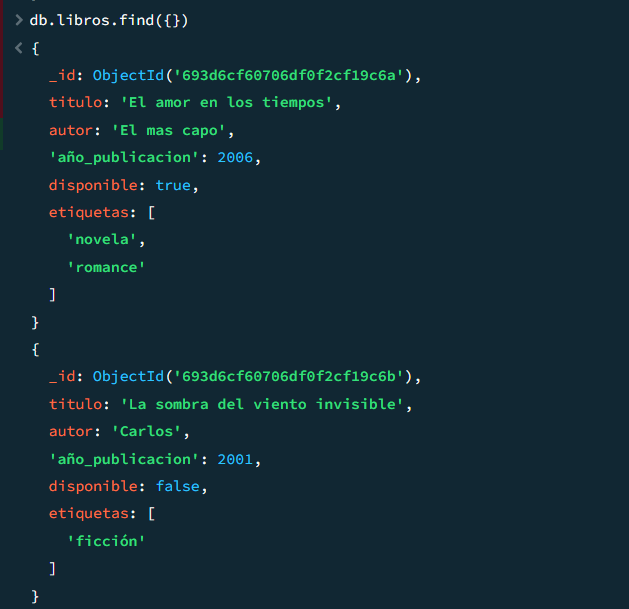
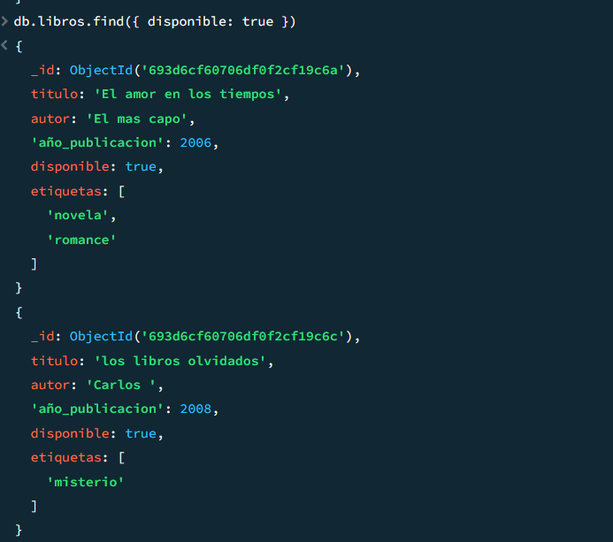
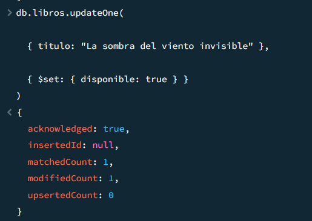
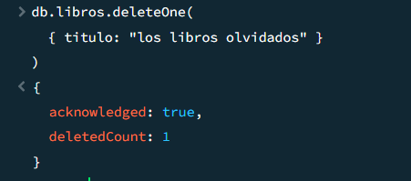

 # Laboratorio 7

Brayan Stiven Chaparro Cataño

### Actividad  #1


### Introducción

En esta actividad se va a ser uso de las base de datos NoSQL para crear una biblioteca y hacer la simulacion de un CRUD usando mongoDB Compas.


### Resolusion

1. Se crea la base de datos

```js
use library
```

según la documentación no existe como tal un comando especifico para crear una base de datos pero el comando anterior hace implicito si existe la base de datos la usa si no la crea pero esta se ve reeflejada cuando se inserta una coleccion.


2. insertar un libro

```json
db.books.insertOne({titulo: "Las aventuras del mod",
    autor: "Nose",
    año_publicacion: 2000,
    disponible: true,
    etiquetas: ["realismo mágico", ]  
    })

```



3. consultar bases de datos

```js
show dbs
```



4. insertra varios libros

```json
db.libros.insertMany([
  {
    titulo: "El amor en los tiempos",
    autor: "El mas capo",
    año_publicacion: 2006,
    disponible: true,
    etiquetas: ["novela", "romance"]
  },
  {
    titulo: "La sombra del viento invisible",
    autor: "Carlos",
    año_publicacion: 2001,
    disponible: false,
    etiquetas: ["ficción"]
  },
  {
    titulo: "los libros olvidados",
    autor: "Carlos ",
    año_publicacion: 2008,
    disponible: true,
    etiquetas: ["misterio"]
  }
])
```


5. consultar

```js
db.libros.find({})
```


6.  consultas con condiciones que esten disponibles

```js
db.libros.find({ disponible: true })
```



*  consultar por un autor especifico

```
db.libros.find({ autor: "Carlos" })
```

7. atualizar

Primero filtramos el documento que se va a actualizar y despues actualizamos el campor

```json
db.libros.updateOne(
  
  { titulo: "La sombra del viento invisible" },

  { $set: { disponible: true } }
)
```



8. eliminar


```json
db.libros.deleteOne(
  { titulo: "los libros olvidados" }
)
```



### Conclusion

Se logro realizar cada uno de los ejercicios planteados en el lab